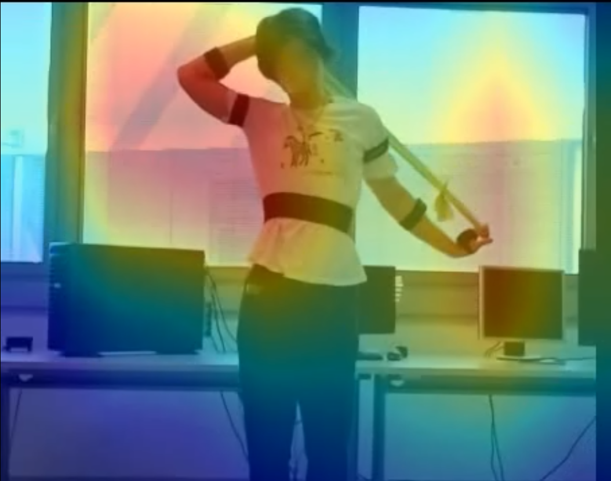

# Rozpoznawanie ćwiczeń w oparciu o 3D-CONV wraz z wizualizacją heat-maps
### Autorzy: Radosław Mocarski, Maciej Pięta, Tomasz Zapart, Jakub Konieczny

## Augmentacji Wideo 
### 1. Cel zmian

Celem modyfikacji było wprowadzenie zaawansowanej augmentacji danych wideo "w locie" (on-the-fly), aby zwiększyć zdolność generalizacji modelu i zapobiec overfittingowi. Kluczowym wymaganiem było zachowanie **spójności czasowej** (temporal consistency) – transformacje geometryczne (np. obrót) muszą być identyczne dla każdej klatki w obrębie jednego klipu wideo.

### 2. Podsumowanie zmian

### Co zostało dodane:

* **Biblioteka `torchvision.transforms.v2`**: Zastąpiono standardowe transformacje nowym API, które obsługuje tensory wideo i automatycznie aplikuje tę samą losową transformację do całej sekwencji klatek.
* **Tryb Debugowania (`--debug`)**: Dodano flagę w `Trainer.py` oraz logikę w `Dataset.py`, która zapisuje próbki wideo "przed" i "po" augmentacji na dysku (folder `debug_output`). Pozwala to na wizualną weryfikację poprawności danych.
* **Zapis Wideo (OpenCV)**: Zaimplementowano funkcję `_save_debug_video` w `Dataset.py`, która konwertuje tensory z powrotem na pliki `.mp4` w celu podglądu.

### Co zostało zmienione:

* **Rozdzielczość Wideo**: Zmniejszono docelową rozdzielczość wejściową sieci do **300x400**, aby ujednolicić dane wyjściowe i ograniczyć zapotrzebowanie na pamięć RAM i VRAM.
* **Logika `__getitem__`**: Przebudowano sposób ładowania danych. Transformacje nie są już wykonywane w pętli na pojedynczych obrazkach. Zamiast tego, klatki są najpierw łączone w jeden tensor [T, C, H, W], a następnie transformowane całościowo.
* **Zarządzanie Pamięcią**: W trybie debugowania wyłączono cache'owanie RAM, aby zawsze generować nowe warianty augmentacji.
* **Obsługa Argumentów**: `Trainer.py` obsługuje teraz argumenty z linii komend (`argparse`).

### Co zostało usunięte:

* Stara metoda transformacji aplikowana wewnątrz pętli `for` podczas czytania klatek (powodowała "migotanie" obrazu, ponieważ każda klatka była losowana osobno).


### 3. Szczegóły Augmentacji

Zastosowano potok transformacji w `torchvision.transforms.v2`, który obejmuje:

1. **Resize**: Skalowanie obrazu z zachowaniem proporcji (krótszy bok dopasowany do wymiaru bazowego).
2. **RandomResizedCrop (do 300x400)**: Losowe wycięcie fragmentu obrazu i przeskalowanie do docelowej rozdzielczości. Symuluje to zmianę odległości kamery (zoom) i drobne przesunięcia kadru.
3. **RandomHorizontalFlip (p=0.5)**: Losowe odbicie lustrzane (kluczowe w fitnessie – uczy model niezależności od strony ciała).
4. **RandomRotation (+/- 10 stopni)**: Symulacja nagrywania "z ręki" lub krzywo ustawionego statywu.
5. **Normalization**: Standaryzacja wartości pikseli (ImageNet stats) dla szybszej zbieżności treningu.


### 4. Instrukcja Uruchomienia

Skrypt `Trainer.py` przyjmuje teraz parametry sterujące procesem.

### A. Tryb Weryfikacji (Debug)

Służy do sprawdzenia, czy augmentacja działa poprawnie i czy dane "mają sens" wizualnie.

* Trenuje tylko na 5% danych (szybki sanity check).
* Zapisuje pliki wideo (oryginał vs augmentacja) w folderze `debug_output`.
* Działa na 1 wątku (dla stabilności zapisu plików na Windows).

```bash
python Trainer.py --debug True

```

### B. Pełny Trening

Uruchamia właściwy proces uczenia na pełnym zbiorze danych.

* Wykorzystuje 100% batchy treningowych.
* Używa wielowątkowości (`num_workers=4` w `Dataset.py`) dla maksymalnej wydajności.
* Nie zapisuje plików wideo na dysku.

```bash
python Trainer.py --debug False --model mobilenet_v2_3d --epochs 10

```

*(Opcjonalnie można wybrać model `pretrained_resnet` zamiast `mobilenet_v2_3d`)*.


### 5. Konfiguracja Techniczna

| Parametr | Wartość | Uwagi |
| --- | --- | --- |
| **Rozdzielczość** | **300x400** (WxH) | Ustandaryzowana jakość detali |
| **Długość klipu** | 16 klatek | Standard dla modeli 3D CNN |
| **Batch Size** | 16 | Dostosuj w dół, jeśli wystąpi `CUDA OOM` |
| **Framework** | PyTorch + Torchvision v2 | Wymaga nowszej wersji Torchvision |
| **Workerzy** | 0 (Debug) / 4 (Train) | Zdefiniowane w `Dataset.py` |


### 6. Optymalizacja Wydajności (CPU Workers)

Liczba wątków procesora (`num_workers`) odpowiedzialnych za ładowanie i augmentację danych jest kluczowa dla szybkości treningu.

*   **Lokalizacja zmiany**: Plik `Dataset.py`, klasa `ExerciseVideoDataModule`, metody `train_dataloader` i `val_dataloader`.
*   **Zalecenia**:
    *   **Windows**: Zalecana ostrożność. Wartość `0` jest najbezpieczniejsza (główny wątek). Wartości `4-8` mogą przyspieszyć trening, ale mogą powodować błędy przy użyciu OpenCV (`cv2`).
    *   **Linux**: Zalecana wysoka wartość (np. liczba rdzeni CPU, typowo `8` lub `16`).
    *   **Sprzęt**: Zawsze uzależniaj tą liczbę od twojego sprzętu na którym pracujesz. Nie przekraczaj liczby rdzeni na wykorzystywanym CPU, a najlepiej zostaw co najmniej jeden na obsługę innych zadań.
*   **Obecna logika**:
    Kod automatycznie ustawia `num_workers=0` w trybie debugowania (dla stabilności), oraz `num_workers=4` w trybie pełnego treningu. Aby to zmienić ręcznie, edytuj argument w wywołaniu `DataLoader`:

    ```python
    # Przykład w Dataset.py
    return DataLoader(..., num_workers=8, ...) # Zwiększenie do 8 wątków
    ```
    

## SparseModel

### 1. Opis Architektury
Model ten to trójwymiarowa sieć neuronowa (3D CNN) zoptymalizowana pod kątem analizy wideo na urządzeniach o ograniczonych zasobach obliczeniowych. Architektura opiera się na koncepcji **Inverted Residuals** oraz **Linear Bottlenecks**, znanych z modelu MobileNetV2, przeniesionych w wymiar czasoprzestrzenny.

#### Kluczowe cechy:
* **Sploty Rozdzielne (3D Depthwise Separable Convolutions):** Redukują koszt obliczeniowy o ok. 8-9 razy w porównaniu do standardowych splotów 3D.
* **ReLU6:** Funkcja aktywacji zapewniająca stabilność przy obliczeniach o niskiej precyzji (np. FP16/INT8).
* **Global Average Pooling (3D):** Sprawia, że model jest odporny na różną długość klipów wideo oraz zmienną rozdzielczość wejściową.


### 2. Struktura Bloku Inverted Residual 3D
Każdy blok składa się z trzech etapów:
1.  **Ekspansja (1x1x1):** Zwiększenie liczby kanałów (zazwyczaj 6-krotne).
2.  **Splot Głębokościowy (3x3x3):** Ekstrakcja cech czasoprzestrzennych (Depthwise).
3.  **Projekcja Liniowa (1x1x1):** Powrót do niższej liczby kanałów bez nieliniowości (Linear Bottleneck).

### 3. Specyfikacja Techniczna (Default)

| Parametr | Wartość | Opis |
| :--- | :--- | :--- |
| **Rozmiar wejściowy** | `[B, 3, 16, 128, 128]` | Batch, RGB, Klatki, Wysokość, Szerokość |
| **Liczba parametrów** | ~2.4 mln | Wersja dla `width_mult=1.0` |
| **Wymiar latentny** | 1280 | Liczba cech przed klasyfikatorem |
| **Aktywacja** | ReLU6 | $f(x) = \min(\max(0, x), 6)$ |


#### 4. Szczegółowa Konfiguracja Warstw

Model wykorzystuje specyficzną strukturę warstw zdefiniowaną w `interverted_residual_setting`. Poniższa tabela przedstawia propagacje danych w przód:

| Etap | Typ Warstwy | Kernel | Stride (T, H, W) | Exp (t) | Kanały (c) | Bloki (n) |
| :--- | :--- | :---: | :---: | :---: | :---: | :---: |
| **Stem** | Conv3d | 3x3x3 | (1, 2, 2) | - | 32 | 1 |
| **Bneck 1** | InvertedResidual | 3x3x3 | (1, 1, 1) | 1 | 16 | 1 |
| **Bneck 2** | InvertedResidual | 3x3x3 | (2, 2, 2) | 6 | 24 | 2 |
| **Bneck 3** | InvertedResidual | 3x3x3 | (2, 2, 2) | 6 | 32 | 3 |
| **Bneck 4** | InvertedResidual | 3x3x3 | (2, 2, 2) | 6 | 64 | 4 |
| **Bneck 5** | InvertedResidual | 3x3x3 | (1, 1, 1) | 6 | 96 | 3 |
| **Bneck 6** | InvertedResidual | 3x3x3 | (2, 2, 2) | 6 | 160 | 3 |
| **Bneck 7** | InvertedResidual | 3x3x3 | (1, 1, 1) | 6 | 320 | 1 |
| **Final** | Conv3d | 1x1x1 | (1, 1, 1) | - | 1280 | 1 |
| **Pooling** | AdaptiveAvg | Global | - | - | 1280 | 1 |
| **Head** | Linear | - | - | - | 17 | 1 |


### 5. Warianty Architektury (Tryby Pracy)

Kod umożliwia wybór trybu działania sieci poprzez parametr `mode`. Pozwala to na balansowanie między szybkością inferencji a zdolnością do rozpoznawania szybkich ruchów.

| Cecha | Mode: `standard` (Domyślny) | Mode: `high_temporal` |
| :--- | :--- | :--- |
| **Strategia Stride'u** | Agresywna redukcja czasu i przestrzeni `(2, 2, 2)` | Zachowanie czasu, redukcja przestrzeni `(1, 2, 2)` |
| **Rozdzielczość Czasowa** | Niska (Features: 1 klatka) | Wysoka (Features: 16 klatek*) |
| **Zużycie Pamięci (VRAM)** | Bardzo Niskie | Średnie (ok. 2-3x wyższe mapy cech) |
| **Zastosowanie** | Ćwiczenia statyczne, wolne ruchy, urządzenia mobile | Szybkie ruchy (boks, skoki), analiza dynamiki |
| **Skip Connections** | Tylko w blokach bez redukcji | Tylko w blokach bez redukcji (identyczna topologia) |

## Heat-maps
### 1. Grad-CAM / HiResCAM

Grad-CAM (Gradient-weighted Class Activation Mapping) i HiResCAM to techniki wizualizacji, które pokazują, które regiony wejścia są istotne dla decyzji klasyfikatora. Generują heatmapę nakładaną na oryginalny obraz/wideo. Grad-CAM używa Global Average Pooling do agregacji gradientów, natomiast HiResCAM mnoży gradienty z aktywacjami element-wise, co pozwala zachować wyższą rozdzielczość przestrzenną.
Do wizualizacji używamy ostatniego bloku konwolucyjnego przed klasyfikatorem, gdyż posiada najwyższy poziom abstrakcji semantycznej.

### 2. Zasada działania

1. Forward pass - zapisanie aktywacji z target layer
2. Backward pass - obliczenie gradientów względem klasy docelowej
3. Ważenie map aktywacji:
   - **Grad-CAM**: Global Average Pooling gradientów, następnie ważona suma aktywacji
   - **HiResCAM**: Element-wise multiplication gradientów i aktywacji (wyższa rozdzielczość)
4. Interpolacja do rozmiaru wejścia
5. Normalizacja i nałożenie na obraz


### 3. Wizualizacja

